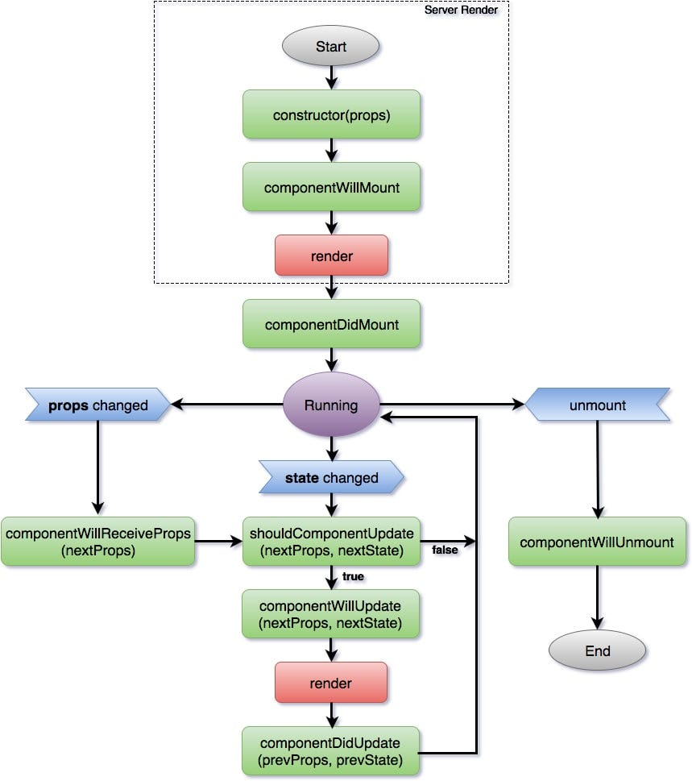
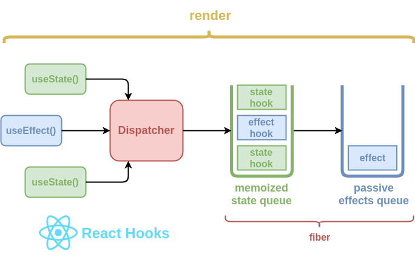

# ReactJS de Básico a Avanzado

<!--  -->

> Alan Badillo Salas (badillosalas@outlook.com)

```markdown
Módulo 4: Ciclo de Vida de un Componente

1. Fases del ciclo de vida en componentes de clase
2. Métodos de ciclo de vida y sus aplicaciones
```
## M401. Fases del ciclo de vida en componentes de clase





## M402. Métodos de ciclo de vida y sus aplicaciones

### Constructor

```jsx
import React from "react"

class App extends React.Component {

    // Propaga el estado inicial 
    // a partir de las propiedades recibidas
    constructor(props) {
        // IMPORTANTE: Se debe construir la clase base
        super(props)

        // En este ejemplo se define un estado determinado
        this.state = {
            fecha: new Date().toLocaleString()
        }
    }

    //...

}

class Counter extends React.Component {

    // Cada componente puede determinar su propio estado
    // por ejemplo: this.state = 123
    // lo más común es que el estado sea un objeto plano (POJO)
    constructor(props) {
        // IMPORTANTE: Siempre se construye la clase base
        super(props)

        // En este ejemplo se determina un estado inicial
        this.state = {
            count: 0,
            autoCount: false
        }

        // Según las propiedades recibidas el estado
        // inicial puede evolucionar durante la construcción
        if (props.initialValue) {
            this.state.count = props.initialValue
        }
        if (props.autoCount) {
            this.state.autoCount = props.autoCount
        }
        
        // El estado final construido dependerá de las
        // propiedades recibidas
    }

    //...

}

class Title extends React.Component {

    // Los constructores tienen la responsabilidad
    // de establecer el estado inicial
    // a partir de las propiedades (atributos)
    // recibidos en la etiqueta de montaje
    // <Title text="Mi App"> genera props.text
    constructor(props) {
        // IMPORTANTE: No se debe olvidar nunca
        // inicializar la clase base con las propiedades
        super(props)

        // En este ejemplo el estado inicial
        // consta de un único valor retenido en una clave
        // aunque durante la ejecución se podrían añadir más
        // pero no es del todo correcto, ya que es bueno
        // determinar completamente el estado y sus claves
        // aunque sus valores sean nulos o indeterminados
        this.state = {
            text: "-"
        }

        // El estado evoluciona durante la construcción
        // solo si se cumplen los criterios
        if (props.text) {
            this.state.text = props.text
        }

        // El state llega a un valor final 
        // (en la fase de construcción)
    }

    // ...

}
```

### Montaje y desmontaje

```jsx
import React from "react"

class App extends React.Component {

    // ...

    // El método de montado o montaje
    // se llama una vez que el componente está construido
    // y pintado por primera vez usando el estado inicial
    componentDidMount() {
        // En este ejemplo se retiene un intervalo
        // que actualiza el estado cada segundo
        this.id = setInterval(() => {
            this.setState({
                fecha: new Date().toLocaleString()
            })
        }, 5_000)
    }

    // El método de desmontado o desmontaje
    // se llama una vez que el componente se quita del DOM
    // y ya no será pintado
    componentWillUnmount() {
        // En este ejemplo borramos el intervalo retenido
        // para no crear fugas de memoria (memory leaks)
        clearInterval(this.id)
    }

    // ...

}

class Counter extends React.Component {

    // ...

    // El montado o montaje
    // ocurre siempre que componente es construido
    // y agregado al DOM, por ejemplo, al cargar una página
    // al actualizar una lista o al volver a nacer
    componentDidMount() {
        // Este ejemplo es similar al anterior
        // y retiene un intervalo, solo si el estado lo determina
        this.id = null

        if (this.state.autoCount) {
            this.id = setInterval(() => {
                this.setState({
                    count: this.state.count + 1
                })
            }, 1_000)
        }
    }

    // El desmontado o desmontaje
    // aún puede acceder al último estado conocido
    // pero no hará más que tareas de limpieza
    // no se puede abortar el desmontado
    componentWillUnmount() {
        // En este ejemplo se borra el intervalo
        // solo si fue propagado condicionalmente
        if (this.id) {
            clearInterval(this.id)
        }
    }

    // ...

}
```

### Actualización de propiedades

```jsx
import React from "react"

class Title extends React.Component {

    // ...

    // Cuando cambian las propiedades
    // se puede aceptar o rechazar el cambio
    // en las propiedades, esto permite
    // cancelar los cambios obligados por
    // rehidratar las propiedades o el estado
    shouldComponentUpdate(nextProps, nextState) {
        // En este ejemplo, siempre se aceptan las nuevas
        // propiedades y se actualiza el estado
        // hacia esas nuevas propiedades
        console.log({ nextProps })
        this.setState({
            text: nextProps.text
        })
        // Siempre se está obligado a devolver `true` o `false`
        return true
    }

    // ...

}
```

### Pintado

```jsx
import React from "react"

class App extends React.Component {

    // ...

    // La vista siempre es el resultado
    // del montado de otras etiquetas
    // ya sean componentes anidados o nativas
    render() {

        // En este ejemplo se regresa un título
        // y dos contadores, uno auto-incremental
        // según sus propiedades
        return (
            <div>
                <Title 
                    text={`App 201 - ${this.state.fecha}`}
                />
                <Counter 
                    initialValue={200}
                    autoCount
                />
                <Counter 
                    initialValue={100}
                    // autoCount={false}
                />
            </div>
        )

    }

}

class Counter extends React.Component {

    // ...

    // La vista puede acceder al estado
    // y del estado construir una interfaz
    // inyectando valores y condicionando el pintado
    render() {

        // condición ? <expressión verdadera> : <expresión falsa>

        // En este ejemplo, se muestran botones
        // condicionados al estado `autoCount`
        return (
            <div>
                <span>Count: {this.state.count}</span>
                {
                    !this.state.autoCount ? (
                        <div>
                            <div>
                                <button>increment</button>
                            </div>
                            <div>
                                <button>decrement</button>
                            </div>
                        </div>
                    ) : null
                }
            </div>
        )

    }

}

class Title extends React.Component {

    // ...

    // El método render debería ser
    // compacto y directo a lo que tiene que mostrar,
    // si es complejo, se puede dividir en más componentes
    render() {

        return (
            <h1>{this.state.text}</h1>
        )

    }

}
```